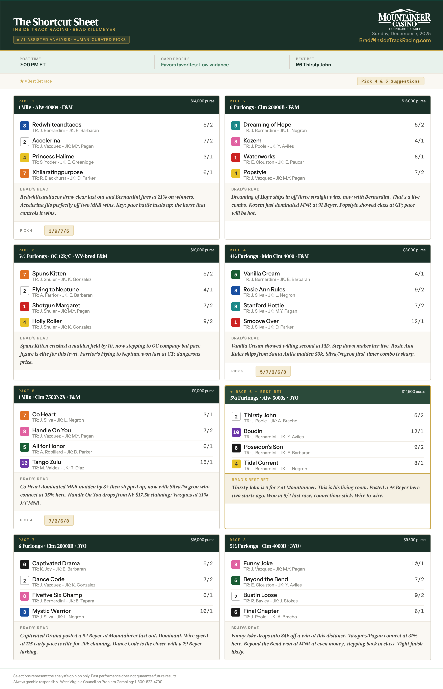

# Track Intel 🏇🏻


[](https://lesliejohnson.io/track-intel)

> Code is private to protect client IP. Full case study at [lesliejohnson.io/track-intel](https://lesliejohnson.io/track-intel).

---

## What it is

Track Intel is an agentic AI pipeline that ingests a Daily Racing Form PDF, generates a clean expert pick sheet, translates it into three languages, and delivers it timed to each market's morning window, with one human approval step before anything goes out.

Built for a horse racing TV analyst with the expertise to produce a premium pick sheet but no infrastructure to scale it.

---

## The problem

A Daily Racing Form PDF is dense with abbreviations, codes, and conventions that take years to learn. For everyone else, it's noise.

The horse racing audience has gone international. Bettors in Latin America and Europe want to participate, but the information infrastructure still assumes an American expert in the grandstand. The problem isn't that the analysis is hard. It's that the starting point requires fluency most bettors don't have.

**The reframe:** this isn't a data problem. It's a translation problem. The racing form has the right information. The pipeline surfaces it.

---

## System design

Seven steps. One deliberate pause.


| Step | What happens | Type |
|------|-------------|------|
| 1. PDF ingest | DRF PDF triggers the workflow. Structured extraction pulls horse, jockey, trainer, class, speed figures, and form cycle into clean objects. | Automated |
| 2. Parse & rank | AI agent applies the expert's ranking logic: speed figures, class drops, connections, pace scenarios, track bias. Output is ranked picks with rationale. | Automated |
| 3. Generate layout | Picks and plain-language rationale rendered into the Track Intel template. Designed to communicate a decision, not educate. | Automated |
| 4. Expert review | Expert receives a formatted preview. Can approve, flag a change, or hold. Nothing sends without release. | **Human gate** |
| 5. Translation | Approved sheet translated into Spanish and Portuguese with racing-specific terminology preserved. | Automated |
| 6. Timezone scheduling | Three sends staged to land in each market's morning window before racing begins. | Automated |
| 7. Distribution | Email delivery to subscribers, segmented by language and market. Co-branded with the racetrack partner. | Automated |

---

## Key design decisions

**Human-in-loop over full automation**
Full automation was technically feasible. It wasn't right. The expert's value is his judgment, not just his data. A fully automated sheet is a product without an author. The one-click approval preserves his voice and his ability to catch a scratch before it becomes an embarrassment. The gate isn't a bottleneck; it's a feature.

**One pipeline, three languages**
The picks are the same. The analysis is the same. What changes is language and delivery time. One pipeline, three outputs. The insight scales; the labor doesn't.

**Layout as decision, not education**
The Daily Racing Form educates. Track Intel orients. The layout strips everything that isn't a decision: race number, pick, plain-language rationale. Signal, not data.

---

## The output

A subscriber should be able to open it, scan it, and feel oriented before coffee goes cold.



---

## Stack

| Layer | Tool | Why |
|-------|------|-----|
| AI ranking | Anthropic | Best-in-class reasoning for domain-specific logic encoding |
| PDF extraction | pdfplumber | Handles DRF's dense columnar format reliably |
| Translation | DeepL | Superior domain vocabulary handling vs Google Translate |
| Email delivery | SendGrid | Reliable segmented sends, good free tier |
| Scheduling | GitHub Actions | Free cron, no server to manage, version-controlled |
| Approval webhook | Railway | Lightweight hosted endpoint, free tier sufficient |

---

## Repo structure

```
track-intel/
├── README.md
├── docs/
│   ├── architecture.md
│   ├── approval-flow.md
│   └── distribution-strategy.md
├── design/
│   ├── shortcut-sheet.html
│   ├── shortcut-sheet-proposal.html
│   └── screenshots/
├── pipeline/                  # structure only, code private
│   ├── ingest.py
│   ├── rank.py
│   ├── format.py
│   ├── approve.py
│   ├── translate.py
│   ├── send.py
│   └── config.py
└── .github/
    └── workflows/
        └── run.yml
```

---

## Status

Pipeline architecture complete. Output artifact designed and production-ready. Build in progress.

---
